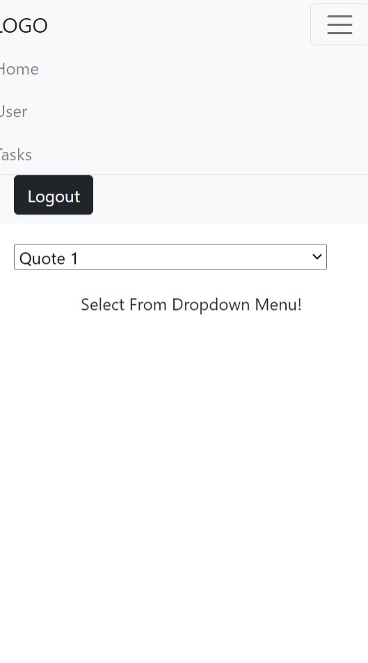
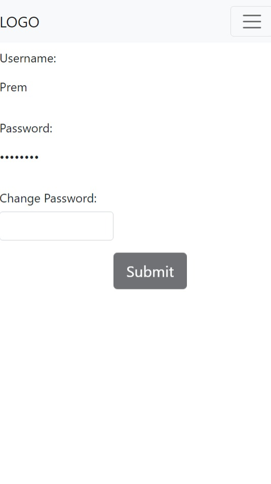
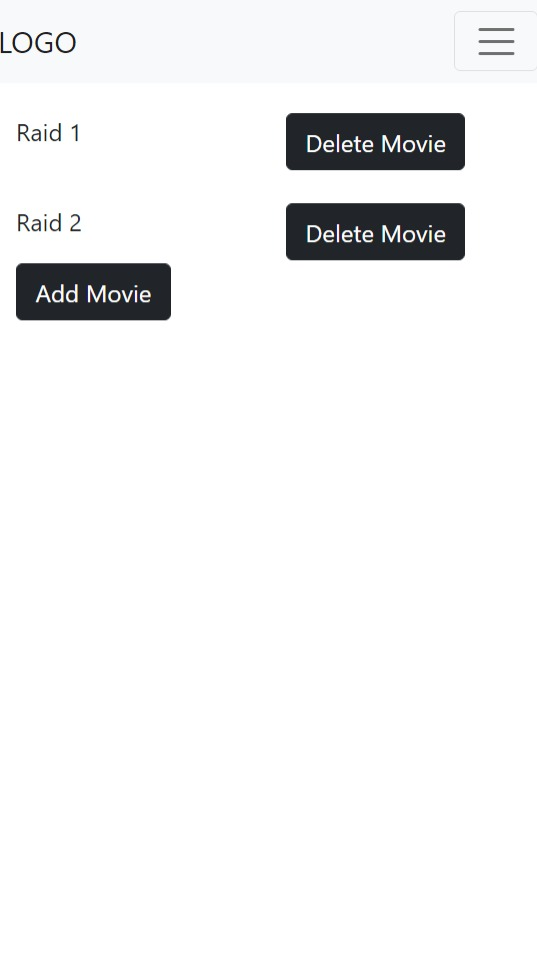

This is a small react app where users can login with a dummy username and password.
Username should not be null and password must be at least 7 characters long.

Here is the link of project with code:

<h4>https://codesandbox.io/s/nimap-machine-test-6l9s6</h4>

<h3>I learnt these topics by making this project.</h3>

How to pass data between components using props?  
How to lift the state up?  
How to use react-router?  
How to fetch data from api?  
How to use react-bootstrap?  
etc...

<h2>Screenshots</h2>

 
 
  
 

After login, you can navigate through different pages of the app via the navigation panel. 

Home Page
>> Here you can select quotes from the dropdown menu and text will change on the screen.

User Page
>> This Page shows your login information and also you can change your password here. And when you click on the submit button it will automatically logout.

Tasks Page
>> Here you can add movies to watch. When you click on the Add movie button it fetches the title of the movie from ( https://swapi.dev/api/films/) and shows on the screen. Also, you can delete the movie by clicking on the delete button.

Logout Button
>> It will immediately redirect you to the login page. Also, If you are not login you can not access any of the above pages. 

This app does not store any of your information.
